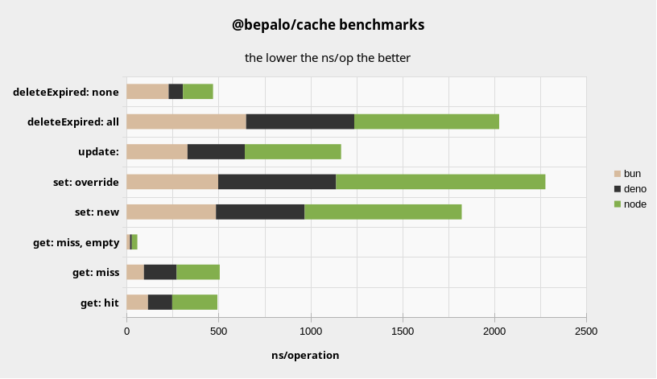
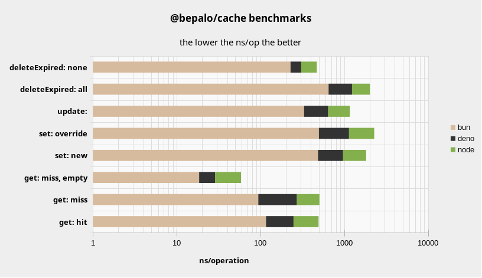

# 🏆 @bepalo/cache

A fast and modern in-memory cache library with TTL and LRU for javascript runtimes.

## 📦 Project Status

Currently the project is in discovery and experimental stage.

## 📢 Benchmarks

These benchmarks were done on the following system with `1,000,000` iterations, 
`10,000` warmup iterations, `500,000` LRU limit and `UUIDv4` keys. Checkout [benchmark](bench/benchmark.js)

**System Info:**

```js
CPU: AMD Ryzen 7 5700U (8 cores, 16 threads)
RAM: 16 GB DDR4
OS: Pop!_OS 22.04 (Linux 6.8)
Node.js: v22.6.0
```

---




---

### 🥇 Bun v1.2.6

<details>
<summary>Bun benchmark results</summary>  

**Benchmarking @bepalo/cache (N=`1,000,000` LRU-Limit=`500,000` K=`UUIDv4`)**

| Operation                    | ns/operation | operations/s |
|------------------------------|-------------:|-------------:|
| cache.get: hit               |      116.564 |    8,578,950 |
| cache.get: miss              |       94.295 |   10,605,059 |
| cache.get: miss, empty       |       18.543 |   53,929,990 |
| cache.set: new               |      486.156 |    2,056,952 |
| cache.set: override          |      498.203 |    2,007,212 |
| cache.update:                |      331.407 |    3,017,433 |
| cache.deleteExpired: all     |      649.958 |    1,538,560 |
| cache.deleteExpired: none    |      228.615 |    4,374,163 |

**Comparing with native Map**

| Operation                    | ns/operation | operations/s |
|------------------------------|--------------|--------------|
| Map.get: hit                 |        9.427 |  106,073,598 |
| Map.get: miss                |        7.259 |  137,769,231 |
| Map.get: miss, empty         |        7.935 |  126,018,988 |
| Map.set:                     |      279.194 |    3,581,743 |
| Map.set: update              |      173.293 |    5,770,580 |
| Map.delete: all              |      191.224 |    5,229,465 |
| Map.delete: none             |       11.472 |   87,171,224 |

</details>

---

### 🥈 Deno v2.4.2

<details>

<summary>Deno benchmark results</summary>

**Benchmarking @bepalo/cache (N=`1,000,000` LRU-Limit=`500,000` K=`UUIDv4`)**

| Operation                    | ns/operation | operations/s |
|------------------------------|-------------:|-------------:|
| cache.get: hit               |      131.629 |    7,597,089 |
| cache.get: miss              |      178.165 |    5,612,785 |
| cache.get: miss, empty       |       10.161 |   98,418,223 |
| cache.set: new               |      482.446 |    2,072,770 |
| cache.set: override          |      641.308 |    1,559,313 |
| cache.update:                |      311.356 |    3,211,761 |
| cache.deleteExpired: all     |      588.244 |    1,699,973 |
| cache.deleteExpired: none    |       77.864 |   12,842,870 |

**Comparing with native Map**

| Operation                    | ns/operation | operations/s |
|------------------------------|--------------|--------------|
| Map.get: hit                 |        8.294 |  120,570,922 |
| Map.get: miss                |        9.033 |  110,710,977 |
| Map.get: miss, empty         |        5.933 |  168,554,446 |
| Map.set:                     |      312.715 |    3,197,799 |
| Map.set: update              |      179.718 |    5,564,266 |
| Map.delete: all              |      218.321 |    4,580,405 |
| Map.delete: none             |       10.184 |   98,192,050 |

</details>

---

### 🥉 Node v22.16.0

<details>
<summary>Node benchmark results</summary>

**Benchmarking @bepalo/cache (N=`1,000,000` LRU-Limit=`500,000` K=`UUIDv4`)**

| Operation                    | ns/operation | operations/s |
|------------------------------|-------------:|-------------:|
| cache.get: hit               |      245.625 |    4,071,248 |
| cache.get: miss              |      234.214 |    4,269,607 |
| cache.get: miss, empty       |       29.907 |   33,436,985 |
| cache.set: new               |      854.164 |    1,170,734 |
| cache.set: override          |    1,138.106 |      878,652 |
| cache.update:                |      523.995 |    1,908,415 |
| cache.deleteExpired: all     |      788.144 |    1,268,803 |
| cache.deleteExpired: none    |      163.846 |    6,103,304 |

**Comparing with native Map**

| Operation                    | ns/operation | operations/s |
|------------------------------|--------------|--------------|
| Map.get: hit                 |      191.249 |    5,228,772 |
| Map.get: miss                |      187.621 |    5,329,892 |
| Map.get: miss, empty         |        9.039 |  110,635,966 |
| Map.set:                     |      291.251 |    3,433,466 |
| Map.set: update              |      239.813 |    4,169,920 |
| Map.delete: all              |      383.207 |    2,609,554 |
| Map.delete: none             |        9.990 |  100,100,731 |

</details>

---

## 📦 Basic Usage


```js
import { Cache } from "@bepalo/cache";

const cache = new Cache();

cache.set("hello", "world");
console.log(cache.get("hello")?.value); // => "world"

cache.delete("hello");
console.log(cache.get("hello")); // => undefined
```

### Using TTL (Time to Live)

```js
const cache = new Cache({
  defaultMaxAge: 1000, // 1 second TTL
});

cache.set("foo", 123);
setTimeout(() => {
  console.log(cache.get("foo")); // => undefined (expired)
}, 1500);
```

### With LRU Eviction

```js
const cache = new Cache({
  lruMaxSize: 2,
});

cache.set("a", 1);
cache.set("b", 2);
cache.set("c", 3); // "a" gets evicted (least recently used)

console.log(cache.has("a")); // => false
console.log(cache.has("b")); // => true
```

### Custom expiration time and cleanup interval

```js
const cache = new Cache({
  defaultExp: () => Date.now() + 5000, // set default expiry using a function
  cleanupInterval: 500, // auto-clean every 500ms
});

cache.set("temp", "value", { maxAge: 100 }); // expires in 100ms

setTimeout(() => {
  console.log(cache.has("temp")); // => false
}, 1000);
```

### Custom time functions

```js
const cache = new Cache({
  now: () => Date.now() / 1000, // now will return time in seconds
  defaultMaxAge: 60 // treated as 60 seconds
  cleanupInterval: 5, // auto-clean every 5sec
});

cache.set("temp", "value", { maxAge: 3 }); // expires in 3sec

setTimeout(() => {
  console.log(cache.has("temp")); // => false
}, 4000);
```

### Using event hooks


```js
const cache = new Cache({
  deleteExpiredOnGet: true,

  onGetHit: (cache, key, entry) => {
    console.log(`Hit: ${key}`);
  },
  onGetMiss: (cache, key, reason) => {
    console.log(`Miss: ${key} (${reason})`);
  },
  onDelete: (cache, key, entry, reason) => {
    console.log(`Deleted: ${key} (${reason})`);
  },
  onDeleteExpired: (count) => {
    console.log(`Expired entries removed: ${count}`);
  }
});

cache.set("x", 42, { maxAge: 10 });

cache.get("y"); // triggers `onGetMiss`

setTimeout(() => {
  cache.get("x"); // triggers `onGetHit`, `onDelete`, `onDeleteExpired`
}, 100);
```

## Sample

```ts
import { Cache } from ".";

const timestampRef = performance.now();
const timestamp = () => `${(performance.now() - timestampRef).toFixed()}ms: `;
const log = console.log;

const cache = new Cache<string, string>({
  // now: () => Date.now(),
  // defaultExp: () => Date.now() + 5000,
  defaultMaxAge: 5000,
  // cleanupInterval: 5000,
  // expiryBucketSize: 5000,
  lruMaxSize: 3,
  // getExpired: true,
  // deleteExpiredOnGet: true,
  onGetHit: async(cache, key, entry) => 
    log(timestamp(), "cache-hit", key),
  onGetMiss: async(cache, key, reason) => 
    log(timestamp(), reason, key),
  onDelete: async (cache, key, entry, reason) => 
    log(timestamp(), "Evict", reason, key),
  onDeleteExpired: async (count) => 
    count > 0 && log(timestamp(), `Expired ${count} entries.`)
}); 

cache.set("item-1", "'sample entry 1'");
cache.set("item-2", "'sample entry 2'", { exp: Date.now() + 2000 });
cache.set("item-3", "'sample entry 3'", { maxAge: 3000 });
cache.set("item-4", "'sample entry 4'", { maxAge: 2500 });

setTimeout(() => log(timestamp(), "1 get", cache.get("item-4")?.value), 1000);
setTimeout(() => log(timestamp(), "2 get", cache.get("item-4", { expired: true })?.value), 2000);
setTimeout(() => log(timestamp(), "3 peek", cache.peek("item-4")?.value), 3000);
setTimeout(() => log(timestamp(), "4 peek", cache.peek("item-4", { expired: true })?.value), 3000);
setTimeout(() => log(timestamp(), "5 get", cache.get("item-4", { deleteExpired: true })?.value), 3000);
setTimeout(() => log(timestamp(), "6 get", cache.get("item-4", { expired: true })?.value), 4000);

for(const [key, entry] of cache) {
  log(timestamp(), key, entry);
}
```

OUTPUT:

```sh
1ms:  Evict LRU item-1
3ms:  item-2 {
  value: "'sample entry 2'",
  exp: 1752603303022,
}
4ms:  item-3 {
  value: "'sample entry 3'",
  exp: 1752603304022,
}
4ms:  item-4 {
  value: "'sample entry 4'",
  exp: 1752603303522,
}
1003ms:  cache-hit item-4
1003ms:  1 get 'sample entry 4'
2003ms:  cache-hit item-4
2003ms:  2 get 'sample entry 4'
3003ms:  3 peek undefined
3003ms:  4 peek 'sample entry 4'
3004ms:  cache-hit item-4
3004ms:  Evict deleted item-4
3003ms:  5 get undefined
4003ms:  missing item-4
4003ms:  6 get undefined
```

